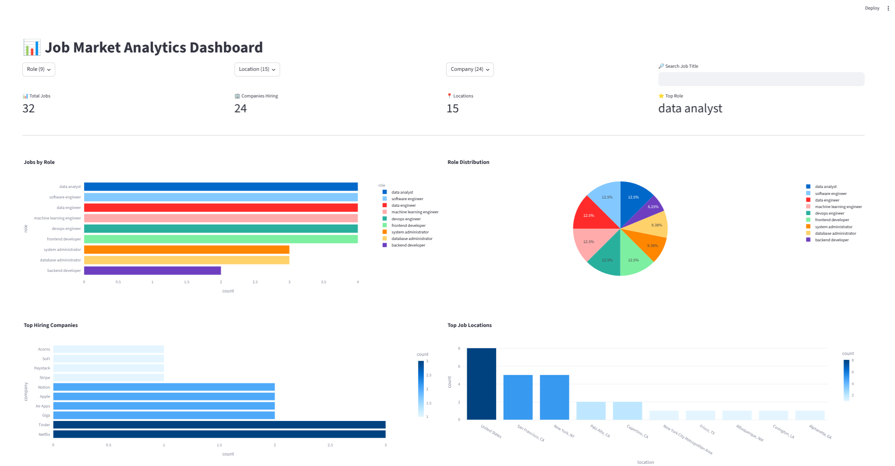

# Tech Job Market Analytics Dashboard

## Project Summary

This project analyzes trends in the technology job market by collecting job listings from LinkedIn using web scraping techniques. The data pipeline begins with a Selenium-based scraper that gathers job information such as job title, company, location, posting date, and job link. The collected data is stored in CSV format and then cleaned and transformed using Pandas to remove duplicates, handle missing values, and standardize formatting.

After cleaning the data, exploratory data analysis (EDA) is performed to uncover patterns in hiring trends across roles, companies, and locations. The processed data is then visualized using Plotly to generate interactive charts.

The final component is a Streamlit dashboard that presents the insights in an interactive web interface. Users can filter results by role, company, and location to explore the job market dynamically. The dashboard includes metrics, multiple visualizations, and a dataset explorer for deeper analysis.

This project demonstrates a full data workflow including web scraping, data cleaning, analysis, visualization, and dashboard development.

---

## Features

* LinkedIn job scraping using Selenium
* Data cleaning and transformation with Pandas
* Exploratory data analysis
* Interactive visualizations with Plotly
* Interactive analytics dashboard built with Streamlit
* Filtering by role, company, and location

---

## Project Structure

```
smart_scraper/
│
├── scraper/
│   └── scrape_jobs.py
│
├── notebooks/
│   ├── clean_jobs.py
│   ├── eda_jobs.py
│   └── visualize_jobs.py
│
├── dashboard/
│   └── app.py
│
├── data/
│   ├── raw_jobs.csv
│   └── cleaned_jobs.csv
│
├── requirements.txt
└── README.md
```

---

## Setup Instructions

### 1. Clone the Repository

```
git clone https://github.com/StealthyScripter/smart_scraper.git
cd smart_scraper
```

### 2. Create Virtual Environment

```
python -m venv venv
```

Activate it:

Mac/Linux

```
source venv/bin/activate
```

Windows

```
venv\Scripts\activate
```

### 3. Install Dependencies

```
pip install -r requirements.txt
```

---

## Run the Data Pipeline

### Scrape Job Data

```
python scraper/scrape_jobs.py
```

### Clean the Dataset

```
python notebooks/clean_jobs.py
```

### Run Exploratory Analysis

```
python notebooks/eda_jobs.py
```

---

## Launch the Dashboard

```
streamlit run dashboard/app.py
```

Then open the browser at:

```
http://localhost:8501
```

---

## Dashboard Screenshot




---

## Technologies Used

* Python
* Selenium
* Pandas
* Plotly
* Streamlit

---

## Future Improvements

* Map visualization of job locations
* Salary analysis if salary data becomes available
* Automated scraping schedule
* NLP skill extraction from job descriptions

---

## Author
Brian Koringo
